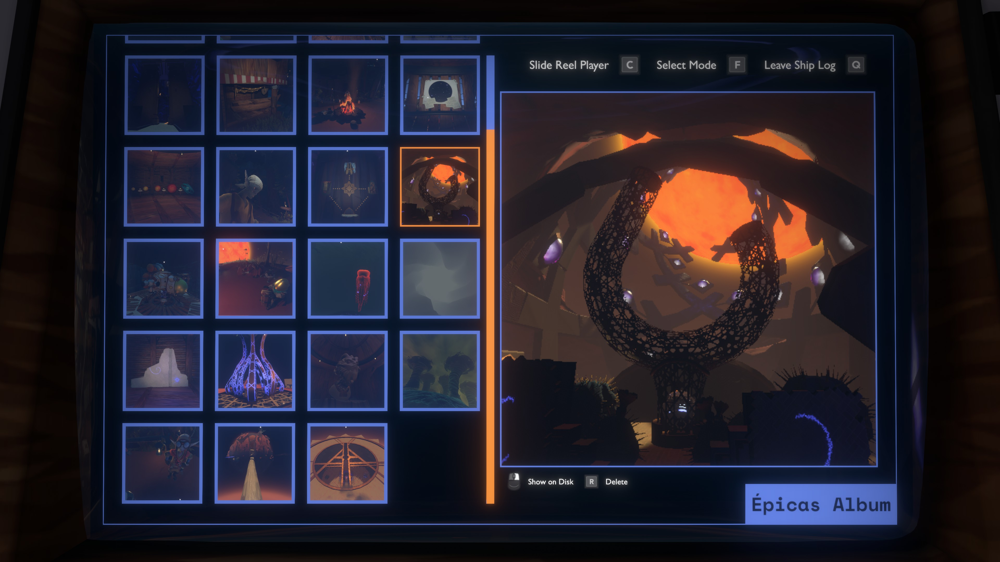

# Épicas Album by Damián Garro


Adds a new [Custom Ship Log Mode](https://outerwildsmods.com/mods/customshiplogmodes/) to the computer, the Épicas Album. This is a gallery-like UI where you can browse snapshots uploaded from your scout.

Photos are uploaded by pressing the lock on button (**left click** in the mouse by default). This saves the currently displayed picture (in your helmet HUD or ship cabin screen) into your device and makes it visible in the Épicas Album mode of your ship computer.

The game by default has black and white scout pictures, so a good companion for this mod is the [Color Cameras](https://outerwildsmods.com/mods/colorcameras/) mod; snapshots uploaded while that mod is active will also include color!



This mod could be a great choice for someone that is doing their first playthrough, because you can use the images to remember important stuff without relying to much on the vanilla ship log, although these snapshots don't include text that you could use to keep notes. For that, you need [The Hatchling's Journal](https://outerwildsmods.com/mods/thehatchlingsjournal/), which adds another mode that lets you create notes and add snapshots from Épicas Album to them!

All photos are saved in a folder "snapshots" inside of the mod folder. The "snapshots" folder has subfolders with the names of Outer Wilds profiles, in each of these subfolders there are all of the images that the Épicas Album displays (using the current profile). You can also go to this folder in your file explorer by using the "**Show on Disk**" option from the album, although this feature currently only works for Windows.

You can even manually add any image to the album by moving image files (*.png* and *.jpg* supported) to the corresponding folder, but you would need to restart the game or the loop to view it in the album. This also applies to deletion of images, but you can already do this with the "**Delete**" option inside the album and the action would be immediately reflected in the UI, a very useful feature if you take a lot of photos and then want to just keep your most **epic**  takes.

## The API

If you are a mod developer, you can use [the API](https://github.com/dgarroDC/EpicasAlbum/blob/main/EpicasAlbum/API/IEpicasAlbumAPI.cs) this mod provides. Currently it has two methods:

---
```cs
public void OpenSnapshotChooserDialog(string defaultSnapshotName, Action<string> selectedSnapshotNameConsumer)
```

Displays the Épicas Album UI in the Ship Log computer (you would probably call this method from your own Ship Log mode), allowing the user to select one of the snapshots. When a selection is made, the UI is closed and the `selectedSnapshotNameConsumer` you provide as a parameter is invoked with the name of the selected snapshot that uniquely identifies it (it's just the name of the file). The user can also close the UI without choosing a snapshot (and this is also their only option when the album is empty). In that case, a `null` value is passed to the `selectedSnapshotNameConsumer`.

There's also the `defaultSnapshotName` parameter. You can pass here the name of the snapshot that would be first selected when opening the UI. If you pass `null` or a snapshot name that doesn't exist, then the selection would be just at the same position as last time the album UI was active.

---
```cs
public Sprite GetSnapshotSprite(string snapshotName)
```

Returns a `Sprite` for the snapshot with the name provided in the `snapshotName`. If not snapshot with that name is found in the album of the current profile, this returns `null`.
